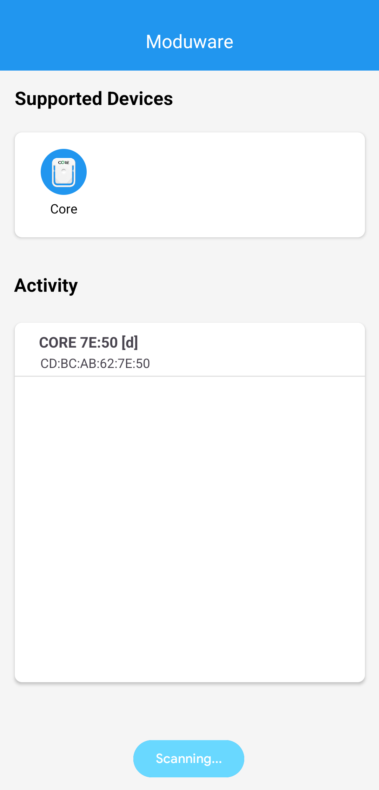
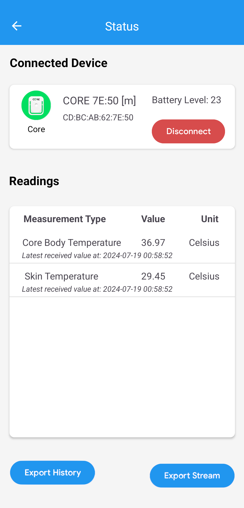

# Moduware
 


## Description
A middleware solution for wearble sensors interface management. It supports multi-sensor connectivity in a centralized app with parallel data stream processing. Its modular design allows for easy integration of new sensors.


## Installation
### Prerequisites
Before you proceed, make sure you have the following installed:

- Java Development Kit (JDK): Ensure you have JDK 8 or later installed. You can download it from here.

- Android Studio: The latest version of Android Studio should be installed.

- Android SDK: Android Studio should be set up with the Android SDK for Android 7.0 (API 24) or later.

### Steps to Clone and Run the Project

#### Option 1:  Clone the Repository via Command Line

##### 1. Clone the Repository:


- Open a terminal window (or command prompt) and navigate to the directory where you want to clone the project.
- Run the following command to clone the repository:
```
git clone https://legolas.bmt.uni-ulm.de/bmt/students/waleedelgamal/modular.git
```

##### 2. Open the Project in Android Studio:
- Open Android Studio.
- Click on File > Open... and navigate to the directory where you cloned the repository.
- Select the project and click OK.


##### 3. Sync Gradle:
- Once the project is loaded, Android Studio should automatically prompt you to sync the Gradle files. If not, click on the Sync Project with Gradle Files button in the toolbar.
- Wait for the sync process to complete. This will download all the required dependencies.


##### 4. Build and Run the Project:
- Build the project by clicking on Build > Build Project in the top menu.
- To run the project on an emulator or a physical device, click on the green Run button in the toolbar or select Run > Run 'app'.
- Choose your target device and click OK.

#### Option 2:  Clone the Repository  Directly from Android Studio

##### 1. Open Android Studio
- Start Android Studio

##### 2. Clone the Repository:
- From the Welcome to Android Studio screen, select Get from VCS (Version Control).
- In the Version control field, select Git.
- Paste the URL of the GitHub repository:
```
https://legolas.bmt.uni-ulm.de/bmt/students/waleedelgamal/modular.git
```
- Choose the directory where you want to store the project on your local machine.
- Click Clone.


##### 3. Open the Project:
- Once the cloning process is complete, Android Studio will automatically open the project.
- If prompted, click Yes to open the project.


##### 4. Sync Gradle:
- Android Studio will prompt you to sync the Gradle files. Click on Sync Project with Gradle Files in the toolbar if it doesn't sync automatically.
- Wait for the sync process to complete.


##### 5. Build and Run the Project:
- Build the project by clicking on Build > Build Project in the top menu.
- To run the project on an emulator or a physical device, click on the green Run button in the toolbar or select Run > Run 'app'.
- Choose your target device and click OK.

### Supported Android Versions
The app is compatible with Android 7.0 (API 24) and above.

## Usage
The current supported sensor is the [CORE Body Temperature Sensor](https://corebodytemp.com). Once you run the project, you will be able to connect to any CORE sensor using the app. 

The app will specifically scan for the chosen device type, and once connected, a new page will be displayed containing all the sensor information. The sensor name, MAC address and battery level are shown. Moreover, all the supported vital readings will be displayed including; the measurement type, the value and the unit. In addition, the timestamp of the latest received data is displayed. The data stream is stored on the phone's local storage.

Two buttons are available at the bottom of the screen for exporting the history data, as well as, the stream data to a CSV file.

In case new sensors are integrated, the user can connect to multiple sensors at the same time and have the data processed concurrently. Sensor connectivity is also maintained while the app runs in the background.

## Contributing
To modify or update the existing code, a fork can be made of the repository.

To integrate a new sensor, a Plugin needs to be developed for that sensor. A plugin is made up of three components: a PluginService class, a GattCallback class and a Parser class. 
Follow the existing code for the CORE plugin to implement a new plugin. A class diagram can be found in the thesis report.

## Authors and acknowledgment
Moduware was created by **[Waleed Elgamal](https://github.com/WaleedElgamal)** as a bachelor project conducted at Ulm University under the supervision of **[Prof. Dr. Walter Karlen](https://www.uni-ulm.de/in/bmt/institut/team/prof-walter-karlen/)**.

## License
This project is licensed under the GNU General Public License v3.0 - see the [LICENSE](LICENSE) file for details.

## Project status
As of August 2024, development was discontinued as the thesis came to an end. Future work may be done.
